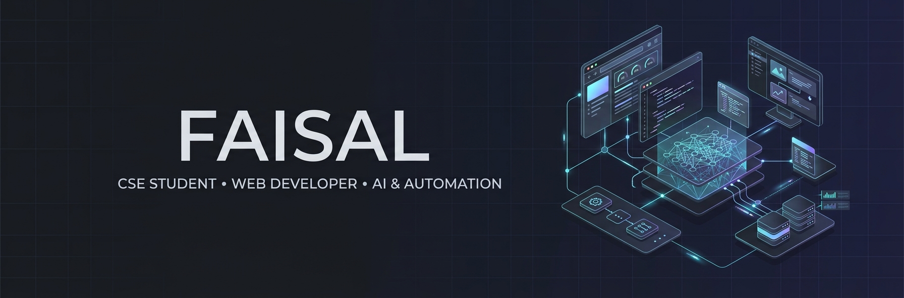
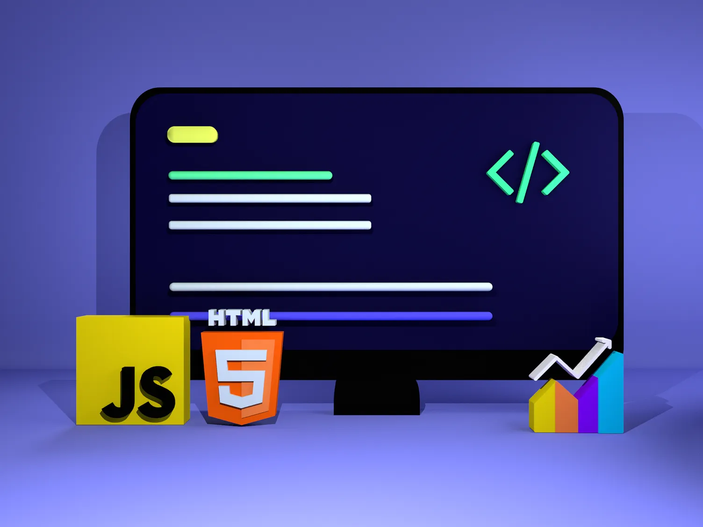

<!-- ======================= BANNER ======================= -->

  

<h1 align="center">Hi 👋, I'm Faisal</h1>

<h3 align="center">
  CSE Student • Web Developer in Progress • Exploring AI & Automation
</h3>

  I enjoy building things, solving problems, and understanding how software works behind the scenes.

---

## 👨‍💻 About Me

- 🎓 **7th Semester CSE student** at American International University-Bangladesh (AIUB)
- 💻 Currently developing my skills in modern web development
- 🤖 Exploring AI-powered applications and automation
- 🧠 Naturally curious and always asking "Why does this work?"
- 🛠️ I learn best by building real projects, debugging problems, and experimenting
- 🚀 Interested in software engineering, product development, and entrepreneurship
- 🎯 Long-term goal: become a strong software engineer and build useful technology products

---

## 🔭 Currently Working On

### 🏗️ RenoCalcHub

A web-based collection of practical construction calculators and tools.

I'm using this project to improve my understanding of:
- Real-world problem solving
- JavaScript and dynamic interfaces
- Search and user experience
- Technical SEO
- Building and maintaining a complete web product

---

## 🌱 Currently Learning

**React • TypeScript • Modern JavaScript • Web Development**

I'm currently focused on strengthening my fundamentals and learning how to build cleaner, more maintainable and scalable applications.

---

## 🧰 Languages & Technologies

### Programming Languages

  
  
  
  
  
  

### Web Development

  
  
  
  
  

### Tools & Frameworks

  
  
  
  

---

## 🚀 Featured Projects

### 🏗️ RenoCalcHub
A web-based collection of practical construction calculators and tools, built to solve real-world calculation problems through a simple interface.

**Tech:** HTML • CSS • JavaScript • Tailwind CSS • Fuse.js • Python

👉 **Repository:** [RenoCalcHub Repo](https://github.com/Md-Rifat-Al-Faisal/RenoCalcHub)  
👉 **Live:** [renocalchub.com](https://renocalchub.com)

### 🖼️ ArtScale
A desktop workflow automation tool for batch image upscaling, compression, dimension management, and metadata preservation.

**Tech:** React • Electron • Python • Real-ESRGAN • NCNN • Pillow

👉 **Repository:** [ArtScale Repo](https://github.com/Md-Rifat-Al-Faisal/ArtScale)

---

## 🎯 What I'm Interested In

- Web Development
- AI-Powered Applications
- Automation
- Problem Solving
- Software Architecture
- Building Useful Products
- Entrepreneurship

---

## 🤝 Connect With Me

  
  
  

---

## 📊 GitHub Activity

  

  

  

---

  <i>"I learn best by building, breaking, fixing, and building again."</i>

